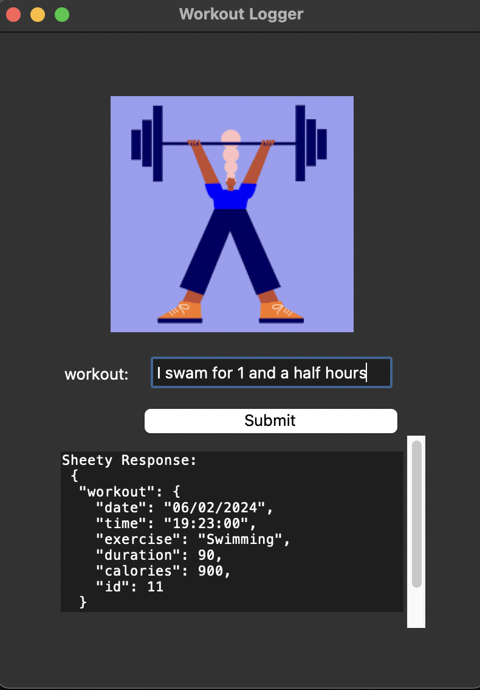

# Workout Tracker

## Overview
This project is a Python application that integrates with the Nutritionix API to allow users to input their exercises 
and track them. It features a simple graphical user interface (GUI) built with Tkinter, where users can enter details 
about their workouts. The application then uses the Nutritionix API to fetch exercise data (such as calories burned and 
duration) and logs this information to a Google Sheet via the Sheety API, enabling easy tracking of physical activities.
Upon a successful submission, the workout information, calories burned, and duration are printed in the text widget.

## Examples
The following screenshots show the application in action:


The application logs the workout data to a Google Sheet:


## Features
- **Exercise Logging:** Users can input the in workout in sentence form they performed directly into the GUI.
- **Nutritionix Integration:** Automatically fetches exercise details like duration and calories burned from the 
Nutritionix API based on user input.
- **Google Sheets Logging:** Uses the Sheety API to log exercise data into a Google Sheet, making it easy to keep a 
history of workouts.

## Prerequisites
- An account with Nutritionix to obtain an API ID and key.
- An account with Sheety to set up Google Sheet logging.
- The `requests` library for making API requests.
- Weight, height, age in metric format.

Additionally, you will need to add API credentials and endpoints to your local environment.

## Setup

1. Clone the repository or download the source code.
2. Install required Python packages
3. Add API credentials and endpoints to local environment:
```python
SHEET_ENDPOINT = "<Your_Sheety_Endpoint>"
GOOGLE_SHEET_NAME = "<Your_Google_Sheet_Name>"
SHEETY_USERNAME = "<Your_Sheety_Username>"
SHEETY_PASSWORD = "<Your_Sheety_Password>"
SHEETY_TOKEN = "<Your_Sheety_Bearer_Token>"
ENV_NIX_APP_ID = "<Your_Nutritionix_App_ID>"
ENV_NIX_API_KEY = "<Your_Nutritionix_API_Key>"
ENV_SHEET_ENDPOINT = "<Your_Sheet_Endpoint>"
```
4. In config.py add your at-birth gender, weight, height, age in metric format.
```python
GENDER = "MALE"
WEIGHT_KG = "100"
HEIGHT_CM = "100"
AGE = "50"
```

## Running the Application
To run the application, execute the following command in your terminal:
```bash
python main.py
```

## Limitations
- The application currently only supports metric units for weight and height.
- The Nutritionix API has a limited number of exercises available, so some exercises may not be recognized.